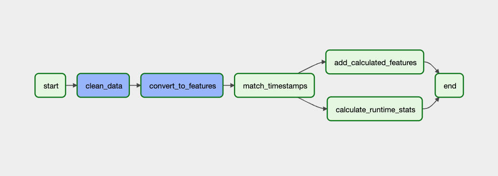

# Overview | Sensor Data ETL Pipeline
*Please note: this solution is still being developed and several described features are in progress.*

This is an example pipeline built as a custom solution to an [assignment provided by Machina Labs](https://github.com/Machina-Labs/data_engineer_hw). It extracts robot sensor data from a Google Cloud Storage (GCS) bucket, transform the data based on a set of specifications, and loads it into a BigQuery data lake for downstream consumption.

The ultimate goal is for the process to be almost entirely automated. A user will be able to upload a file to the [sensor_data_files/out](./sensor_data_files/out) directory, the transformation workflow will be triggered on that event, and a resulting CSV with transformed data will land back into a GCS bucket. The CSV file can then be downloaded by the user to the [sensor_data_files/in](./sensor_data_files/in) directory via a manual GitHub Action. 

# Tech Stack
- [Google Cloud Platform (GCP)](https://cloud.google.com/gcp)
- [Google Cloud Storage (GCS)](https://cloud.google.com/storage/docs)
- [Cloud Functions](https://cloud.google.com/functions/docs)
- [Apache Airflow](https://airflow.apache.org/docs/apache-airflow/stable/) - workflow as code - written in Python
  - Running on a GCP hosted Composer cluster
- [BigQuery](https://cloud.google.com/bigquery/docs) - Data lake
  - Transformation logic written in standard SQL

### Why these tools?  
- These are tools that I work with every day and am most familiar with. I have a GCP instance set up as a playground and was able to leverage those resources to automate this solution in the cloud.
- All are great choices for running ETL pipelines and were well-suited to this type of structured data.

# Project Structure 
- [.github](./.github) - contains GitHub Action files (CI)
  - [composer-ci.yaml](./.github/workflows/composer-ci.yaml) - syncs files inside of the [sensor_data_etl](./sensor_data_etl) directory with a DAG bucket inside of GCS
- [data_dictionaries](./data_dictionaries) - schemas for raw and transformed data
- [img](./img) - contains images used in documentation
- [sensor_data_etl](./sensor_data_etl) - files for the task workflow
  - [sql](./sensor_data_etl/sql) - contains the SQL transformation logic for tasks
  - [trns_sensor_data.py](./sensor_data_etl/trns_sensor_data.py) - defines set of tasks in Python
- [sensor_data_files](./sensor_data_files) - contains raw and transformed files
  - adding a .parquet file matching the schema in the [raw sensor data dictionary](./data_dictionaries/raw_sensor_data_dictionary.csv) to this directory will trigger the transformation process. Once the transformation is complete, a GitHub Action can be run to download the transformed file in CSV format (in progress). Note: if the schema doesn't match the target structure, the workflow will fail on the first task.
- [.gitignore](./.gitignore) - designates files to exclude when commiting to Git
- [instructions.md](./instructions.md) - contains instructions for this assignment.
- [demo_video.mp4](./demo_video.mp4) - provided to give context to robot actions
- [README.md](README.MD) - project documentation (this file)

# Continuous Integration / Development (CI/CD)
## Environments
Code deployments are separated into two main environment branches, dev and main. Code deployed to the dev branch allows for testing before pushing changes to the cloud. Merging changes to main will push them to the cloud.

## GitHub Actions
- composer-ci.yaml - used to sync DAG directory (sensor_data_etl) with DAG bucket in GCP 
  - this action runs when a change is made to a file inside of the sensor_data_etl directory
  - it syncs with DAG bucket in GCP that houses Airflow DAGs

# ETL Data Flow Narrative
1. Extract parquet file from GCS bucket and import into a BigQuery table in the raw layer dataset (raw_sensor_data_prod) - DONE
2. Clean raw data - DONE
    - Deduplicate & trim
      - cast all columns to correct datatype based on the raw sensor data dictionary
      - Note: descriptive numbers are converted to strings in accordance with best practices
3. Convert Features - DONE
    - convert timeseries to features by robot_id
    - create hash codes (primary key) to tie back to raw layer
      - identifies each row w/ a unique key
      - helps in preventing appending duplicate data
4. Match timestamps with measurements - IN PROGRESS
5. Calculated Features - TO DO 
   - 6 Velocity values (vx_1, vy_1, vz_1, vx_2, vy_2, vz_2)
   - 6 Acceleration values (ax_1, ay_1, az_1, ax_2, ay_2, az_2)
   - Total Velocity (v1, v2)
   - Total Acceleration (a1, a2)
   - Total Force (f1, f2)
6. Runtime Statistics - TO DO
   - run_uuid
   - run start time
   - run stop time
   - total runtime
   - total distance draveled
7. Perform data quality (DQ) checks - TO DO
8. Load final table into transformed layer of data warehouse for downstream consumption - TO DO

# Contributing
To contribute, clone this repo and create a feature branch from main. Push changes to dev and open a PR from dev to main.
## Adding tasks to the DAG
Add a task to the [trns_sensor_data.py](sensor_data_etl/trns_sensor_data.py) workflow. Example task:

      name_of_task = BigQueryOperator(
        task_id="name_of_task",
        sql = 'sql/name_of_task.sql',
        params={"clean_table_location": "project_id.dataset_name.table_name"},
        destination_dataset_table = "project_id.dataset_name.table_name",
        create_disposition = "CREATE_IF_NEEDED",
        write_disposition = "WRITE_TRUNCATE",
        use_legacy_sql=False 
    )

The above example task will create a new table in BigQuery based on whatever SQL logic is in the .sql file referenced. Params are additional parameters you can pass to the SQL file. The destination dataset table should be updated with the full table location. Airflow is flexible and extendible - check out their [library of operators](https://airflow.apache.org/docs/apache-airflow/stable/concepts/operators.html) for a better idea of what all tasks can be added.
## Updating Transformation Logic
To update the transformation logic (add features, etc.), update the SQL file corresponding to the task.

# Access

# Future Improvements / Enhancements (In Progress)
- Automate the CI pipeline so that when a parquet file is added to the data directory in the repo, it triggers the workflow in GCP, runs transformation, then returns a transformed file to the bucket (using cloud functions). Transformed file can then be downloaded (via GH Action) by the user.
- Add Airflow exception operator to provide specificity in logs