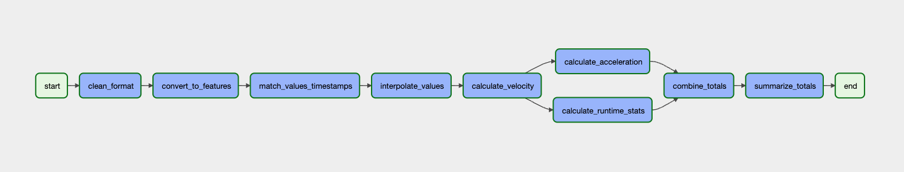

# Overview | Sensor Data ETL Pipeline

This is an example pipeline built as a custom solution to an [assignment provided by Machina Labs](https://github.com/Machina-Labs/data_engineer_hw). It extracts robot sensor data from a Google Cloud Storage (GCS) bucket, transforms the data based on a set of specifications, and loads it into a BigQuery data warehouse for downstream consumption.

# Tech Stack
- [Google Cloud Platform (GCP)](https://cloud.google.com/gcp)
- [Google Cloud Storage (GCS)](https://cloud.google.com/storage/docs)
- [Apache Airflow](https://airflow.apache.org/docs/apache-airflow/stable/) - workflow as code - written in Python
  - Running on a GCP hosted Composer cluster
- [BigQuery](https://cloud.google.com/bigquery/docs) - Data warehouse
  - Transformation logic written in standard SQL

### Why these tools?  
- These are tools that I work with every day and am most familiar with. I wanted to build an automated solution using cloud resources to highlight my strongest skillsets.
- All are great choices for running ETL pipelines and were well-suited to this type of structured data. This workflow could be set up on any other cloud provider with minimal code changes.

# Project Structure 
- [.github](./.github) - contains GitHub Action files (CI)
  - [composer-ci.yaml](./.github/workflows/composer-ci.yaml) - syncs files inside of the [sensor_data_etl](./sensor_data_etl) directory with a DAG bucket inside of GCS
- [data_dictionaries](./data_dictionaries) - schemas for raw and transformed data
- [img](./img) - contains images used in documentation
- [sensor_data_etl](./sensor_data_etl) - files for the task workflow
  - [sql](./sensor_data_etl/sql) - contains the SQL transformation logic for tasks
  - [trns_sensor_data.py](./sensor_data_etl/trns_sensor_data.py) - defines set of tasks in Python
- [sensor_data_files](./sensor_data_files) - contains raw and transformed files
- [terraform](./terraform) - contains terraform modules that create the cloud infrastructure - this is a replica of a setup in a private repo and is not connected to an action
- [.gitignore](./.gitignore) - designates files to exclude when commiting to Git
- [instructions.md](./instructions.md) - contains instructions for this assignment
- [demo_video.mp4](./demo_video.mp4) - provided to give context to robot actions
- [README.md](README.MD) - project documentation (this file)

# Continuous Integration / Development (CI/CD)
## Environments
Code deployments are separated into two main environment branches, dev and main. Code deployed to the dev branch allows for testing before pushing changes to the cloud. Merging changes to main will push them to the cloud.

## GitHub Actions
- [composer-ci.yaml](./.github/workflows/composer-ci.yaml) - used to sync DAG directory (sensor_data_etl) with DAG bucket in GCP 
  - this action runs when a change is made to a file inside of the sensor_data_etl directory
  - it syncs with DAG bucket in GCP that houses Airflow DAGs

# ETL Workflow 
1. Extract parquet file from GCS bucket and into a BigQuery table in the raw layer dataset
2. Clean raw data
    - Deduplicate & trim
      - cast all columns to correct datatype based on the raw sensor data dictionary
      - Note: descriptive numbers are converted to strings in accordance with best practices
3. Convert Features
    - convert timeseries to features by robot_id
    - create hash codes (primary key) to tie back to raw layer
      - identifies each row w/ a unique key
      - helps in preventing appending duplicate data
4. Match timestamps with measurements
5. Calculated Features 
   - 6 Velocity values (vx_1, vy_1, vz_1, vx_2, vy_2, vz_2)
   - 6 Acceleration values (ax_1, ay_1, az_1, ax_2, ay_2, az_2)
   - Total Velocity (v1, v2)
   - Total Acceleration (a1, a2)
   - Total Force (f1, f2)
6. Runtime Statistics
   - run_uuid
   - run start time
   - run stop time
   - total runtime
   - total distance draveled
8. Load final table into transformed layer of data warehouse for downstream consumption

# Cloud Infrastructure
The cloud resources used for this solution were deployed through terraform as shown in the [terraform](./terraform) directory. List of cloud resources created and used for this project:
- Composer/Airflow instance
- 2 cloud storage buckets
  - sensor_data_files (extraction bucket)
  - dag bucket (used for Airflow DAG files - syncs to [sensor_data_etl](./sensor_data_etl) directory)
- 3 BigQuery datasets
  - raw_sensor_data - houses raw tables as imported from .parquet files
  - trns_sensor_data - houses transformed tables
  - w_sensor_data - houses work (staging) tables used in transformation 
- IAM 
  - 1 service account - key in GitHub secrets

# Contributing
## Adding tasks to the DAG
Add a task to the [trns_sensor_data.py](sensor_data_etl/trns_sensor_data.py) workflow. Example task:

      name_of_task = BigQueryOperator(
        task_id="name_of_task",
        sql = 'sql/name_of_task.sql',
        params={"clean_table_location": "project_id.dataset_name.table_name"},
        destination_dataset_table = "project_id.dataset_name.table_name",
        create_disposition = "CREATE_IF_NEEDED",
        write_disposition = "WRITE_TRUNCATE",
        use_legacy_sql=False 
      )
      name_of_task.set_upstream(name_of_task_upstream)

The above example task will create a new table in BigQuery based on whatever SQL logic is in the .sql file referenced. Params are additional parameters you can pass to the SQL file. The destination dataset table should be updated with the full table location (in GCP it's project.dataset.table). You set the task by calling name_of_task() or if there are dependencies set an upstream task to wait on using set_upstream.

Airflow is flexible and extendible - check out their [library of operators](https://airflow.apache.org/docs/apache-airflow/stable/concepts/operators.html) for information on what all tasks can be added.
## Updating Transformation Logic
To update the transformation logic (add features, etc.), update the SQL file corresponding to the task.
## Access
The transformed files can be found in the [sensor_data_files](./sensor_data_files/in) directory.

- [trns_calculated_features.csv.gz](./sensor_data_files/in/trns_calculated_features.csv.gz) - fully transformed data based on assignment specifications
  - gzipped to save space
- [trns_calculated_summary.csv](./sensor_data_files/in/trns_calculated_summary.csv) - a summary of calculated features by run_uuid
- [trns_runtime_stats.csv](./sensor_data_files/in/trns_runtime_stats.csv) - contains runtime statistics by run_uuid
- [trns_base_values.csv.gz](./sensor_data_files/in/trns_base_values.csv.gz) - contains base values - before interpolation 
  - gzipped to save space

I'm happy to grant viewer access to BigQuery and Composer to view the tables and workflows (provide gmail address).

# Future Improvements
- Automate pipeline so that when a file is uploaded to the repo inside of the OUT directory, it syncs to a GCS bucket 